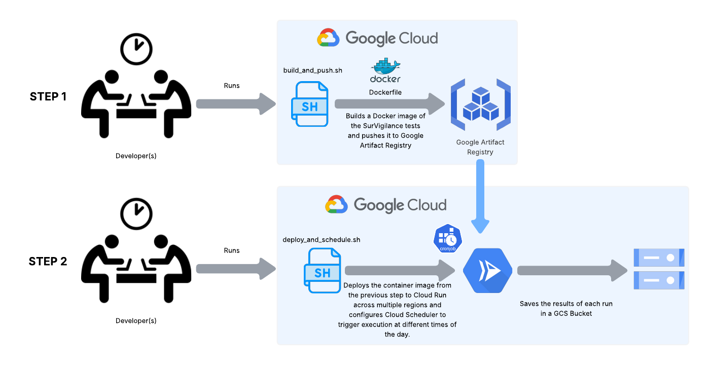

# SurVigilance-GCP

This repository contains the necessary scripts and configurations for deploying and managing the SurVigilance application on Google Cloud Platform (GCP).

## Project Aim

The SurVigilance-GCP project aims to provide a comprehensive, automated framework for continuously testing the "SurVigilance" package across various Google Cloud Platform regions. It focuses on ensuring regular operation and robust testing through scheduled job execution and automated reporting.

## Dockerfile Overview

*   `Dockerfile`: This file defines a Docker image that includes Python, Google Chrome, the Google Cloud SDK, and the SurVigilance package. The image is configured to run the test suite upon startup.

## Shell Scripts Overview

*   `build_and_push.sh`: This script builds a Docker image of the application and pushes it to Google Artifact Registry. It ensures that the required Google Cloud services are enabled and creates an Artifact Registry repository if one doesn't exist.
*   `deploy_and_schedule.sh`: This script deploys the Docker image as a Cloud Run job and sets up Cloud Scheduler jobs to trigger it periodically across multiple Google Cloud regions. It requires the user to update placeholder variables for `PROJECT_ID`, `IMAGE_PATH`, and `SERVICE_ACCOUNT`.
*   `run_tests.sh`: This script executes Pytest tests, generates an Excel report of the test results, and uploads the report to a specified Google Cloud Storage (GCS) bucket. Users must update the placeholder for `<YOUR BUCKET NAME>` in the script.
*   `download_data_gcs.sh`: This script downloads the Excel reports from the GCS bucket into the local `Data Files` directory.

## Python Scripts Overview

*   `data_processing_script.py`: This script reads the downloaded Excel reports from the `Data Files` directory, processes the data to create a summary of failed tests by region and time, and saves the output to `result_table.xlsx`.

## Data Files

*   `Data Files/`: This directory is used to store the raw Excel test reports downloaded from Google Cloud Storage.
*   `result_table.xlsx`: This Excel file contains a summary of the test results, showing failed tests for each region at different times.

## Schematic Diagram Depicting the Workflow

